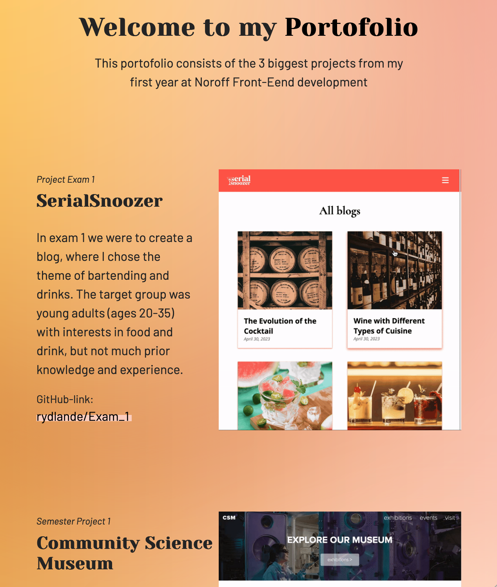

portofolio1.github.io

# Portofolio 1 - Course assigment

This site is for my course assigment called "Portofolio 1", it consists of my 3 biggest submissions for the school year 22/23.

## Description

Portfolio 1 is an assignment to showcase my projects from the first year of front-end development at Noroff School of Technology. The 3 projects presented are:

<ul>
<li>Project Exam 1</li>
<li>Semester Project 1</li>
<li>Cross-course project</li>
</ul>

## Built With

    HTML/CSS, in Visual Studio Code.

## Getting Started

### Installing

Clone the repo:

    gh repo clone rydlande/Portofolio_1

Install the dependencies:

    npm install

### Running

To run the app, run the following commands:

    npm run start

## Contact

(https://www.linkedin.com/in/eirin-rydland-944b49210 "My LinkedIn page")

## Acknowledgments

Thank to my graphic designer (sister), Kristin, for helping me make a background for my Portofolio.
